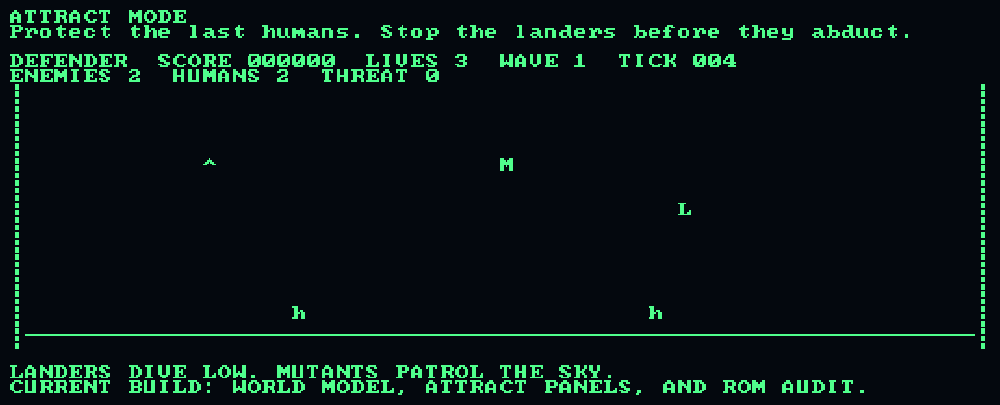

# Defender

[](https://sonarcloud.io/summary/new_code?id=stephenlclarke_defender)
[](https://sonarcloud.io/summary/new_code?id=stephenlclarke_defender)
[](https://sonarcloud.io/summary/new_code?id=stephenlclarke_defender)
[](https://sonarcloud.io/summary/new_code?id=stephenlclarke_defender)
[](https://sonarcloud.io/summary/new_code?id=stephenlclarke_defender)
[](https://sonarcloud.io/summary/new_code?id=stephenlclarke_defender)
[](https://sonarcloud.io/summary/new_code?id=stephenlclarke_defender)
[](https://sonarcloud.io/summary/new_code?id=stephenlclarke_defender)
[](https://sonarcloud.io/summary/new_code?id=stephenlclarke_defender)
[](https://sonarcloud.io/summary/new_code?id=stephenlclarke_defender)
[](https://sonarcloud.io/summary/new_code?id=stephenlclarke_defender)


`defender` is a native Rust implementation of Williams Defender red-label
arcade behavior. The runtime is self-contained: red-label tables, ROM metadata,
trace schema, video data, and sound command fixtures are embedded at build
time, so normal play does not need a local ROM or asset directory.

Live play uses a windowed `wgpu` renderer.




## Install

Install from git with Cargo:

```sh
cargo install --git https://github.com/stephenlclarke/defender defender
```

Then run:

```sh
defender
```

## Run

Common commands:

```sh
cargo run
cargo run -- --input-profile planetoid
cargo run -- --input-profile cabinet
cargo run -- --cmos-path ~/.local/state/defender/red-label-cmos.bin
cargo run -- --live-smoke
cargo run -- --game-smoke
cargo run -- --mute
cargo run -- --rom-report
cargo run -- --rom-report /path/to/roms
cargo run -- --verify-roms /path/to/roms
```

Fidelity and trace tooling:

```sh
cargo run -- --fidelity-trace 300
cargo run -- --fidelity-trace-inputs 'coin,start_one;fire,thrust;none'
cargo run -- --fidelity-trace-inputs-file /path/to/inputs.txt
cargo run -- --fidelity-check-trace /path/to/inputs.txt /path/to/expected.tsv
cargo run -- --fidelity-check-trace-dir docs/fidelity/fixtures/local/rust-current
cargo run -- --fidelity-list-scenarios
cargo run -- --fidelity-write-scenario-inputs docs/fidelity/fixtures/local/reference
cargo run -- --fidelity-check-reference-trace-dir docs/fidelity/fixtures/local/reference
```

Make targets:

```sh
make run
make run-wgpu
make live-wgpu
make smoke-wgpu
make ci
make ci-doctor
make trace-doctor
make coverage-doctor
make smoke-doctor
make fidelity
make trace-script-test
make trace-fixtures
make reference-inputs
make reference-traces
make reference-fixtures-check
make coverage
make coverage-new-code NEW_CODE_COVERAGE_BASE=origin/main
make coverage-new-code-baseline NEW_CODE_COVERAGE_BASE=origin/main
make sq-ci
make sq
make readme-media
```

`make readme-media` regenerates `docs/start-sequence.gif` from the current
renderer.

## Controls

The default live input profile is `planetoid`, which maps BBC Micro
Planetoid-style keys onto Defender cabinet actions:

- `5`: left coin slot
- `6`: center coin slot
- `7`: right coin slot
- `1` or `ENTER`: one-player start when credit or free play is available
- `A`: move up
- `Z`: move down
- `SHIFT`: thrust
- `SPACE`: reverse
- `ENTER`: fire while playing
- `TAB`: smart bomb
- `H`: hyperspace
- `F2`: service advance / diagnostics target
- `F3`: reset today's high-score table from ROM defaults
- hold `F4` with `F2`: select the auto/audits target
- `F5`: slam / tilt switch
- `A`-`Z`: enter initials during high-score entry
- `BACKSPACE`: delete the previous initial during high-score entry
- `Q` or `ESC`: quit

Use `--input-profile cabinet` for a MAME-style cabinet profile. In that
profile, `5` inserts a left-slot coin and `1` starts a one-player game;
`ENTER` is not a start key.

To start a normal one-player game from a fresh session, press `5`, then `1`.
The red-label start path intentionally blocks no-credit starts unless the
cabinet is configured for free play.

## Persistence

Live CMOS persistence is opt-in. Without `--cmos-path`, each run starts from
embedded red-label defaults and does not create or update a CMOS file. Provide
`--cmos-path <file>` to persist high scores, credits, audits, and adjustment
CMOS cells across runs.

## XYZZY Overlay

During live play, type `X`, `Y`, `Z`, `Z`, `Y` to toggle `XYZZY` mode.

`XYZZY` is a deliberate compatibility overlay, not Williams red-label arcade
behavior. With it disabled, trace generation and live core stepping stay on the
red-label path.

Current overlay hooks:

- `F`: toggles auto-fire while `XYZZY` is active.
- `TAB`: can emit an overlay smart bomb after red-label inventory reaches zero
  while `XYZZY` is active.
- `G`: toggles the recorded invincibility overlay flag. It is trace-invisible
  until an arcade-facing hook is implemented.

Typing `XYZZY` again disables the overlay and resets overlay toggles.

## Development

Primary validation commands:

```sh
cargo fmt --check
cargo test --all-targets
cargo clippy --all-targets -- -D warnings
make fidelity
cargo run -- --game-smoke
cargo run -- --live-smoke
markdownlint README.md SPEC.md PLAN.md docs/fidelity/refactor-freeze.md
```

`make fidelity` runs formatting, all Rust targets, clippy, Lua trace exporter
self-tests, Python helper tests, local Rust trace fixture comparison, coverage,
and new-Rust-line coverage. The new-line gate compares against
`NEW_CODE_COVERAGE_BASE` when set, otherwise `HEAD` for local dirty worktrees.
`make coverage-new-code` requires an explicit base and subtracts the accepted
uncovered-line baseline in `tools/new_rust_coverage_baseline.txt`; refresh that
baseline only when intentionally accepting existing uncovered debt. `make ci`
adds the `wgpu` live smoke test. GitHub CI runs `make ci-doctor`, then
`make fidelity`, then `xvfb-run -a make smoke-wgpu` so prerequisite, fidelity,
coverage, and smoke failures are separated in the Actions UI. The
`make smoke-doctor` target is Linux CI-oriented and expects `xvfb-run` plus
`vulkaninfo`.
Slack completion notes are a best-effort project protocol outside CI; connector
or token failures should be handled as Slack tooling failures, not Rust
validation failures.

Local SonarCloud support:

```sh
make sq-ci
make sq
```

`make sq` requires `sonar-scanner` and `SONAR_TOKEN`.

## Architecture

The primary source tree is now the clean rewrite under `src/`; the converted
implementation is parked under `src_legacy/` and remains wired through
`src/lib.rs` as the internal gameplay oracle and runtime bridge. Clean
runtime launch goes through the private `src/runtime.rs` bridge, while the
internal oracle reaches accepted behavior through the crate-private
`src/accepted.rs` facade before `src/oracle.rs` adapts it to gameplay state.
The actual legacy machine bridge lives in `src_legacy/accepted_behavior.rs`,
keeping legacy imports out of the clean accepted-behavior surface. The root
legacy adapters remain crate-private; README media generation uses the doc-hidden
`defender::readme_media` facade instead of low-level machine, input, or video
exports. Machine process/state contracts, red-label math types, and low-level
asset, board, memory, ROM, sound, live, PIA, and `wgpu` modules stay
crate-private. Generated long-trace sample fixtures are private to the legacy
machine oracle, not root-wired through the clean crate.

Clean rewrite modules:

- `src/accepted.rs`: crate-private accepted-behavior contracts and facade over
  the temporary adapter.
- `src/game.rs`: gameplay-facing `Game`, `GameState`, `GameInput`,
  `GameFrame`, `GameEvents`, world, terrain, starfield, enemy, human, score,
  projectile, player, direction, and sound-event contracts without accepted
  command-byte mapping. The clean `Game` shell emits sprite-first scene frames
  without touching the accepted machine adapter.
- `src/game_smoke.rs`: the crate-private clean game smoke command that steps
  `Game` through scripted controls, verifies sprite plus native pipeline and
  draw-instance coverage, verifies sprite buffer upload-plan evidence, and
  prepares emitted scenes with the native renderer draw planner.
- `src/systems.rs`: deterministic fixed-step timing utilities, clean
  player-control intent/trigger systems, operator trigger handling,
  player-motion, enemy-motion, projectile launch/capacity/motion systems,
  projectile/enemy collision detection, player/enemy damage resolution,
  smart-bomb resolution, wave-completion evaluation, score/bonus awards,
  high-score entry qualification and initials handling, and the
  `GameSimulation` trait used by the clean game and internal oracle
  implementations.
- `src/renderer.rs`: native `wgpu` scene contracts, surface sizing, sprite
  layers, temporary raster evidence, renderer-owned resources, atlas-backed
  sprite batches, sprite quad geometry, sprite instance buffers, the sprite
  instance GPU ABI, sprite instance upload streams, sprite draw commands,
  sprite `wgpu` buffer upload plans, sprite render-pass plans, sprite pipeline
  plans, sprite resource binding plans, sprite atlas texture upload plans,
  sprite pipeline layout plans, sprite render pipeline descriptor plans,
  sprite render-pass encoder command plans, frame-level GPU command plans,
  viewport layout, GPU pass planning, scene summaries, render signatures, and
  draw planning.
- `src/platform.rs`: the clean runtime launch boundary plus configuration for
  controls, audio, run mode, and persistence.
- `src/runtime.rs`: the crate-private launch bridge that translates clean
  runtime configuration into launch commands and routes config-driven `wgpu`
  live and smoke launches.
- `src/live_wgpu.rs`: the crate-private WGPU live launch facade that owns the
  temporary presenter/input-profile bridge for interactive and smoke runs.
- `src/roms.rs`: the crate-private optional ROM verification facade that owns
  the temporary ROM metadata, scan, and loader bridge.
- `src/audio.rs`: gameplay-facing sound events, the bounded live-audio runtime,
  no-device backends, and worker diagnostics. It consumes clean `GameFrame`
  and `SoundEvent` contracts, not legacy frame outputs.
- `src/fidelity.rs`: clean frame-equivalence signatures over gameplay state,
  gameplay events, sound events, and render summaries. Clean fidelity tests use
  oracle-owned reference probes instead of importing accepted facade types
  directly.
- `src/fidelity_manifest.rs`: the crate-private fidelity scenario manifest
  facade that owns temporary scenario metadata and input expansion.
- `src/fidelity_trace_engine.rs`: the crate-private fidelity trace engine
  facade that owns temporary trace generation, comparison, and schema access.
- `src/oracle.rs`: the crate-private gameplay oracle, returning clean state,
  event, sound, and scene-summary frames from the accepted-behavior facade for
  internal fidelity comparison.

Legacy source-shaped modules under `src_legacy/` still own the accepted arcade
behavior, assets, hardware models, ROM verification, rendering, input,
sound-board command evidence, legacy fidelity trace generation and threaded
fixture checks, the threaded live core runtime boundary, `wgpu` window
ownership, CMOS storage, and test helpers. `src_legacy/accepted_behavior.rs`
owns the temporary accepted-machine adapter for the internal oracle, and
`src/live_wgpu.rs` owns the temporary presenter/input-profile bridge used by
config-driven `wgpu` live and smoke launches. `src/roms.rs` owns the temporary
ROM metadata, scan, and loader bridge for optional verification commands.
`src/fidelity_manifest.rs` owns the temporary scenario manifest and input
expansion bridge for fidelity scenario commands. `src/fidelity_trace_engine.rs`
owns the temporary trace generation, comparison, and schema bridge for fidelity
trace commands.
Legacy-specific clean equivalence
regressions are also wired from `src_legacy/` so `src/accepted.rs` and
`src/oracle.rs` stay focused on clean gameplay contracts. They remain wired as
doc-hidden legacy bridge modules rather than supported public API.
Internal clean equivalence regressions use crate-private oracle wiring, while
clean frame-signature gates live under `src/fidelity.rs` and compare clean
render signatures rather than exposing memory-oriented CRC labels. Legacy live
code adapts frame outputs into clean audio frames before submitting to
`src/audio.rs`. README media tooling uses the narrow doc-hidden
`defender::readme_media` facade. The binary enters through the clean platform
boundary before delegating to the runtime bridge. `--game-smoke` steps the clean
game through scripted controls, verifies required gameplay sprite layers,
sprite IDs, and native draw-command pipeline and instance coverage, and prepares
sprite-only native draw plans plus frame-level `wgpu` command,
resource-binding, pipeline-layout, pipeline descriptor, encoder, and upload
plans without entering the legacy live presenter. The clean `Game` world
seeds
terrain, starfield, enemy, human, and projectile snapshots for the first playing
wave and renders them as atlas-backed scene sprites. Operator controls are
sampled through `OperatorControlSystem`, emitting diagnostics, audits, and
high-score reset gameplay events on button edges while preserving current
player scores and bonus thresholds during high-score reset. Clean enemy
snapshots carry gameplay-domain velocity and advance through
`EnemyMotionSystem` during playing frames. Clean projectile snapshots carry
direction-derived velocity, advance through `ProjectileMotionSystem`, and are
culled through gameplay state before rendering. Clean collision boxes resolve
projectile/enemy hits through `CollisionSystem`, remove the hit entities from
world state, and award score through `ScoreSystem` before rendering. Crossing
the clean bonus threshold updates player stock and emits `BonusAwarded`. Clean
smart bombs consume player stock, clear active enemies through
`SmartBombSystem`, route score through the same scoring system, and leave
cleared enemies absent from the scene. Enemy contact with the player is
resolved through clean collision and `PlayerDamageSystem`, decrementing lives,
removing the colliding enemy, and entering `GameOver` on the final life.
Qualifying final scores are routed through `HighScoreEntrySystem` into
`HighScoreEntry` with `HighScoreEntryStarted` output. High-score entry accepts
alphabetic initials through clean input, normalizes them to uppercase, supports
backspace, emits `HighScoreInitialAccepted`, and emits `HighScoreSubmitted`
when the third initial returns the clean game to attract. Enemy exhaustion is
reported through `WaveSystem`, keeping the last-hit frame empty and spawning
the next clean wave on the following playing frame. Native draw planning
resolves scene sprites
through
renderer-owned atlas regions into sprite batches and records GPU
instance-buffer data with native scene rectangles, normalized atlas UVs,
normalized tint, stable record counts and upload bytes, and the `wgpu` vertex
layout for the instance buffer. It flattens those
per-batch records into one upload-ready
instance stream. The renderer also owns unit quad vertices, `u16` indices,
record counts, upload bytes, and the `wgpu` vertex layout used to draw
instanced sprites, then derives indexed instanced sprite draw commands with
quad/index counts, instance ranges, and upload byte spans into that stream.
Sprite draw plans also include
`wgpu::BufferUsages` metadata and upload bytes for the quad vertex, quad index,
and instance buffers, plus a sprite render-pass plan with stable vertex buffer
slots, index-buffer metadata, and indexed instance draw ranges. Sprite pipeline
plans describe the renderer-owned WGSL shader, vertex and fragment entry
points, quad and instance vertex layouts, alpha-blended color target, primitive
state, and multisample state for the target texture format. Sprite resource
binding plans describe the scene-projection uniform upload, projection bind
group layout, atlas texture binding, atlas sampler binding, and atlas texture
upload metadata used by that shader. The default clean sprite atlas owns
deterministic nonblank RGBA pixels plus the `wgpu` texture format, usage,
extent, and copy layout needed to populate it. Sprite pipeline layout plans
then order those projection and atlas bind groups for `wgpu`
`PipelineLayoutDescriptor` creation, and sprite render pipeline descriptor
plans combine that layout with shader entries, vertex buffers, primitive state,
color target, and multisample state for `wgpu` render pipeline creation. Sprite
render-pass encoder command plans then order the pipeline, bind groups, vertex
buffers, index buffer, and indexed draw calls for `wgpu::RenderPass` execution.
Frame-level GPU command plans combine pass clear state, viewport,
scene-projection upload presence, optional sprite execution, and temporary
raster evidence into one ordered scene command stream. It also records the
centered viewport layout plus GPU-ready clear color, viewport command, and
scene-projection constants for the target surface. The live worker still wraps
accepted visual output as a clean `RenderScene` raster payload before the
presenter draws it. Kitty graphics and
terminal-session code remain parked there as historical compatibility evidence,
but they are no longer active runtime or compatibility API paths. The legacy
video renderer owns its remaining `TerminalGeometry` value type directly so it
does not pull terminal session setup into active builds. Generated long-trace
sample data is nested under the legacy machine oracle because it is historical
fixture evidence, not a clean root adapter. A public API guard scans clean
module sources so new production code cannot import low-level legacy root
modules, bypass the accepted-behavior facade, or reintroduce legacy
implementation terminology.

## Assets And ROMs

Clean runtime data lives under `assets/red-label/` and is embedded in the
binary. The active assets include ROM metadata, MAME memory/input maps,
red-label RAM/CMOS layouts, linked lists, routine addresses, switch tables,
object pictures and images, terrain data, wave data, high-score/default data,
sound command timelines, the live-audio acceptance matrix, and fidelity trace
schemas.

Local ROM files are optional verification inputs for `--rom-report` and
`--verify-roms`. They are not needed for normal play.

Legacy prototype images and sounds under `assets/arcade/` and `assets/sounds/`
are retained only as references unless a module explicitly reclassifies them
with source or ROM provenance.

## Platform Support

- Live backend: `wgpu`, through `cargo run` or `defender`.
- Live audio consumes gameplay-facing `SoundEvent` batches through a bounded
  non-blocking runtime with worker diagnostics. The built-in backend is a null
  backend that opens no audio device; `--mute` disables the runtime path.
  Audible device output is still future work. The accepted implementation
  contract is in
  `docs/fidelity/live-audio.md`.

## References

- Red-label source and ROM build reference:
  <https://github.com/mwenge/defender>
- MAME Williams driver and ROM map:
  <https://github.com/mamedev/mame/blob/master/src/mame/midway/williams.cpp>
- MAME Williams video implementation:
  <https://github.com/mamedev/mame/blob/master/src/mame/midway/williams_v.cpp>
- MAME Motorola 6821 PIA implementation:
  <https://github.com/mamedev/mame/blob/master/src/devices/machine/6821pia.cpp>
- Williams sound-ROM source:
  <https://github.com/historicalsource/williams-soundroms>
- Defender setup and operations manual:
  <https://arcade-museum.com/manuals-videogames/D/DefenderSetupBookletUSA.pdf>
- Williams Defender cabinet reference:
  <https://williamsarcades.com/Defender>
- Red-label ROM metadata reference:
  <https://mdk.cab/game/defender>
- Defender behavior analysis:
  <https://www.dougmahugh.com/defender-chapter02/>
- BBC Micro Planetoid archive entry:
  <https://bbcmicro.co.uk/game.php?id=11>
